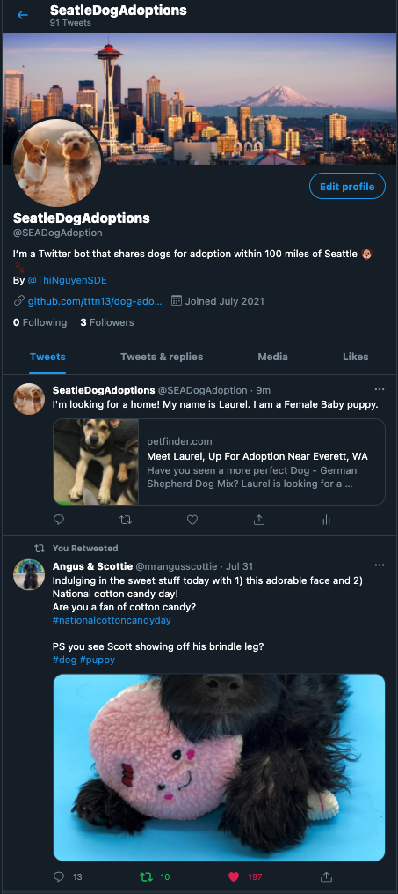

# Dog Adoption Twitter Bot
[Live Demo](https://twitter.com/SEADogAdoption)

This is a Twitter bot that shares new dogs that are up for adoption every hour within 100 miles of Seattle Metro area. The bot will also retweet any status that contains '#puppy' and '#dog' with a media attachment. 



### Searching function

 To search for tweets that match the desired parameters: 

```sh
const searchTweets = (callback) => {
  let params = {
    q: "#puppy #dog filter:media",
    count: 1,
    result_type: "mixed",
    lang: "en",
  };

  twitterClient.get("search/tweets", params, (err, data, response) => {
    if (data && data.statuses.length > 0) {
      //tweets results are stored in the data.statuses array, we only want 1 tweet so we access it via index
      let tweet = data.statuses[0];
      callback(tweet); // we passed in the tweet to the callback function, which can be a retweet function or a like function
      return;
    } else {
      console.log("Cannot grab tweet because of ", err);
    }
  });
};

```
### Callback Function for the returned tweet(s) 
After getting the data from the API, I want the bot to like and retweet the tweet(s) so I will make 2 callback functions called `retweetFn` and `likeTweet`

Below is the `retweetFn` function 
```sh
const retweetFn = (tweet_object) => {
    twitterClient.post(
        'statuses/retweet/' +
        tweet_object.id_str,
    (err, data, response) => {
      if (err) {
        //if error do something
        return;
      }
      //if success do something
      console.log("Success, Check your Account for the Retweet!");
    }
  );
};
```


Below is the `likeTweet` function

```sh
const likeTweet = (tweet_object) => {
  twitterClient.post(
    "favorites/create",
    { id: tweet_object.id_str },
    (err, data, response) => {
      if (!err) {
          // do something 
      }
      else {
          // do something
      }
    }
  );
};
```

### Set an interval 
 I want the bot to run each hour and search for recent and top tweets on the given hashtag(s). If there is any then the bot will like and retweet. 

The bot will also look up the PetFinder API to see if there's any new dog adoption in the area in the last hour. If there is then the bot will post a new tweet containing the link and important info.

## Technologies 
- NodeJS
- Twitter API
- PetFinder API
- Heroku deployment
